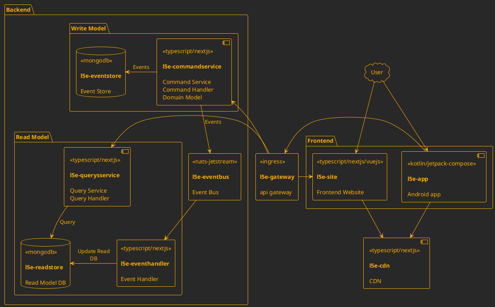

# l5e architecture documentation

```plantuml
@startuml
!theme crt-amber

cloud "User" as user

rectangle "<<ingress>>\n\n**l5e-gateway**\n\napi gateway" as api_gateway
component "<<typescript/nextjs>>\n\n**l5e-cdn**\n\nCDN" as cdn
package "Frontend" {
    component "<<kotlin/jetpack-compose>>\n\n**l5e-app**\n\nAndroid app" as app
    rectangle "<<typescript/nextjs/vuejs>>\n\n**l5e-site**\n\nFrontend Website" as frontend
}

package "Backend" {
    package "Write Model" {
      component "<<typescript/nextjs>>\n\n**l5e-commandservice**\n\nCommand Service\nCommand Handler\nDomain Model" as cmd_service
      database "<<mongodb>>\n\n**l5e-eventstore**\n\nEvent Store" as event_store
    }

    rectangle "<<nats-jetstream>>\n\n**l5e-eventbus**\n\nEvent Bus" as event_bus

    package "Read Model" {
      component "<<typescript/nextjs>>\n\n**l5e-querysservice**\n\nQuery Service\nQuery Handler" as query_service
      database "<<mongodb>>\n\n**l5e-readstore**\n\nRead Model DB" as user_db
      rectangle "<<typescript/nextjs>>\n\n**l5e-eventhandler**\n\nEvent Handler" as event_handler
    }
}

user -down-> app
app -down-> api_gateway
app -down-> cdn
api_gateway -left-> cmd_service
api_gateway -right-> query_service

cmd_service -left-> event_store : Events
cmd_service -down-> event_bus : Events

event_bus --> event_handler
event_handler -right-> user_db : Update Read\nDB
query_service --> user_db : Query

api_gateway -right-> frontend
frontend -down-> cdn
user --> frontend

@enduml
```
